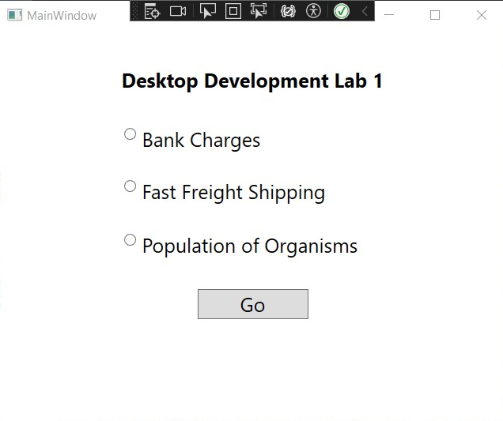
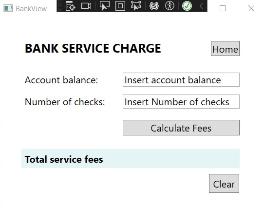
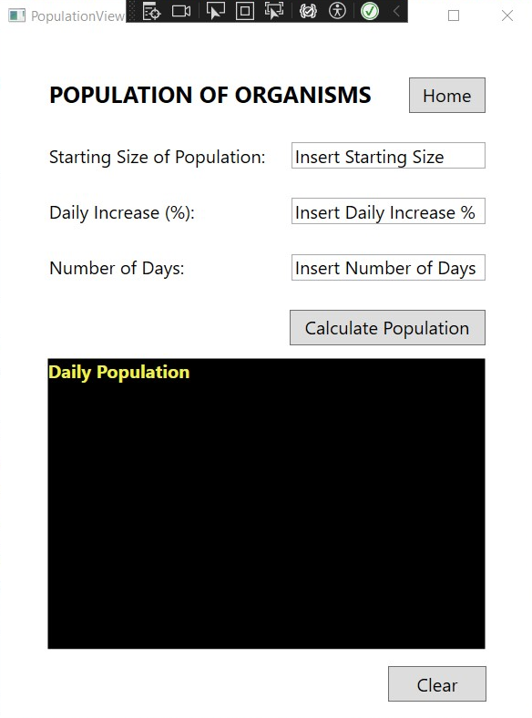
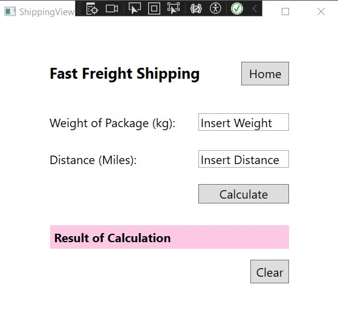

# DesktopDevEQ3Lab1

Lab 1 is a collection of programs related to various calculations and operations. It consists of the following components:

1. **BankView**: This component calculates bank service fees based on the account balance and the number of checks written. It provides a graphical user interface (GUI) for input and displays the calculated fees.

2. **PopulationView**: This component calculates the daily population growth of organisms. It takes the starting population, daily increase percentage, and the number of days as input and displays the population of each day.

3. **ShippingView**: This component calculates shipping charges based on the weight of the package and the distance it needs to be shipped. It takes the item's weight and shipping distance and displays the calculated shipping charges.

4. **MainWindow**: This is the main entry point of the program. It displays a GUI with three radio buttons to select which component to use. When a radio button is selected and the "Go" button is clicked, the corresponding component's window is opened.

## Getting Started

To use this project, follow these steps:

1. Clone the repository or download the source code.

2. Open the project in your preferred development environment (e.g., Visual Studio).

3. Build the solution to ensure all dependencies are resolved.

4. Run the application.

## Usage

1. BankView:
   - Enter the account balance and the number of checks written.
   - Click the "Calculate" button to calculate the bank service fees.
   - The total fees for the month will be displayed.

2. PopulationView:
   - Enter the starting population, daily increase percentage, and the number of days.
   - Click the "Calculate" button to calculate the daily population growth.
   - The population of each day will be displayed.

3. ShippingView:
   - Enter the weight of the package and the distance it needs to be shipped.
   - Click the "Calculate" button to calculate the shipping charges.
   - The total charge for shipping will be displayed.

4. MainWindow:
   - Choose the radio button of desired view, i.e. Bank Charges for Bank View, Population of Organisms for PopulationView, or Fast Freight Shipping for ShippingView.
   - Only one radio button can be selected.
   - Click the "Go" button to go to the dselected view.
   - The selected view will be displayed.

## XAML Files

The project includes the following XAML files:

### BankView.xaml
This XAML file represents the BankView window of the application. It contains elements such as labels, text boxes, and buttons related to bank account information and fee calculations.

### MainWindow.xaml
This XAML file represents the MainWindow of the application. It includes radio buttons for selecting different functionalities of the application and a "Go" button to proceed with the selected option.

### PopulationView.xaml
This XAML file represents the PopulationView window of the application. It includes elements like labels, text boxes, and buttons for calculating and displaying population data based on user inputs.

### ShippingView.xaml
This XAML file represents the ShippingView window of the application. It contains elements for calculating shipping charges based on package weight and distance.

## Images of Views

||
|:--:|
|Figure 1: MainWindow|

||
|:--:|
|Figure 2: BankView window|

||
|:--:|
|Figure 3: PopulationView window|

||
|:--:|
|Figure 4: ShippingView window|
