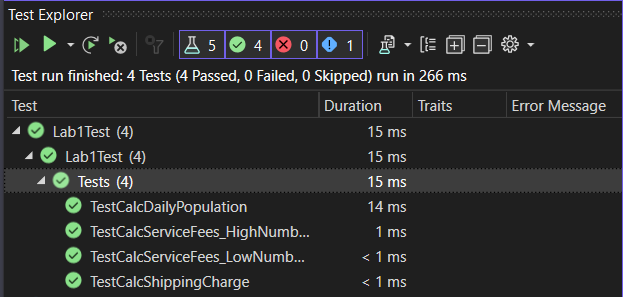

# Lab2_NUnit_Test

This is the `UnitTest1.cs` file for NUnit testing of the classes `Population`, `BankCharges`, and `ShippingCharges` in the `Lab1` namespace.

### TestCalcDailyPopulation
This test method verifies the correctness of the `calcDailyPopulation` method in the `Population` class. It sets up the `Population` instance with a starting size of 100, daily increase percent of 5, and the number of days as 7. The expected population list is calculated based on the given inputs, and then it compares the expected population with the actual daily population returned by the `calcDailyPopulation` method using `CollectionAssert.AreEqual`.

### TestCalcServiceFees_LowNumberOfChecks
This test method tests the `CalcServiceFees` method in the `BankCharges` class for the scenario with a low number of checks (10 checks). The test sets up the `BankCharges` instance with an account balance of 500 and 10 checks. It calculates the expected total fees based on the check fees and monthly base fee and uses `Assert.That` to check if the actual total fees are equal to the expected fees (up to 2 decimal places).

### TestCalcServiceFees_HighNumberOfChecks
This test method is similar to the previous one but tests the `CalcServiceFees` method with a higher number of checks (20 checks). It checks the correctness of the fees calculation for a different scenario, where the number of checks falls between the lower and upper bounds.

### TestCalcShippingCharge
This test method verifies the `CalcShippingCharge` method in the `ShippingCharges` class. It sets up the `ShippingCharges` instance with a weight of 5.5 and a distance of 1200. The expected shipping charge is calculated based on the given inputs, and then it compares the expected charge with the actual shipping charge returned by the `CalcShippingCharge` method using `Assert.That`.

Please note that the expected values have been rounded to two decimal places to account for potential floating-point precision issues in the calculations.

**Note:** Make sure you have appropriate test data for each scenario, and adjust the expected values accordingly to match the expected results of the test methods.

### Screenshot
||
|:--:|
|Figure 1: Tests|
